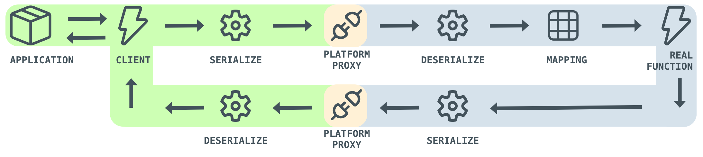

<p align="center">
    <a href="https://github.com/xplpc/xplpc" target="_blank" rel="noopener noreferrer">
        
    </a>
    <br>    
    XPLPC - Cross Platform Lite Procedure Call
    <br>
</p>

<p align="center">
    <a href="https://github.com/xplpc/xplpc/actions/workflows/c.yml"></a>
    <a href="https://github.com/xplpc/xplpc/actions/workflows/cxx.yml"></a>
    <a href="https://github.com/xplpc/xplpc/actions/workflows/kotlin.yml"></a>
    <a href="https://github.com/xplpc/xplpc/actions/workflows/swift.yml"></a>
    <a href="https://github.com/xplpc/xplpc/actions/workflows/wasm.yml"></a>
    <a href="https://github.com/xplpc/xplpc/actions/workflows/flutter.yml"></a>
</p>

<p align="center">
    <a href="https://www.codacy.com/gh/xplpc/xplpc/dashboard?utm_source=github.com&amp;utm_medium=referral&amp;utm_content=xplpc/xplpc&amp;utm_campaign=Badge_Grade"></a>
</p>

## Project

The XPLPC project connects languages and platforms, allowing for the transfer of serialized data between them. This is achieved without the need for a server, but instead by utilizing device memory. This approach is known as Lite Procedure Call.

The Platform Proxy class plays a crucial role in this process by connecting both languages and platforms, and facilitating the transfer of data using device memory instead of the HTTP protocol. This allows for a more efficient and streamlined communication process.

For example, you can call a procedure written in C++ code from a mobile application, or vice versa, with ease. This opens up a wide range of possibilities for developers and allows for a more seamless integration of different languages and platforms.

The XPLPC project is also highly user-friendly, as it does not require the use of generators or additional tools. This means that the generated library can be added to your existing project without the need for any rewriting of code. This plug-and-play feature allows for full code reuse and makes the integration process smooth and hassle-free.

## Workflow

<p align="center">
    <a href="https://github.com/xplpc/xplpc" target="_blank" rel="noopener noreferrer">
        
    </a>
</p>

## How to use

Using C++ code:

```cpp
auto request = Request{
    "platform.battery.level",
    Param<std::string>{"suffix", "%"},
};

RemoteClient::call<std::string>(request, [](const auto &response) {
    std::cout << "Returned Value: " << (response ? response.value() : "Empty") << std::endl;
});
```

Using Kotlin code:

```kotlin
val request = Request(
    "sample.login",
    Param("username", "paulo"),
    Param("password", "123456"),
    Param("remember", true)
)

RemoteClient.call<String>(request) { response ->
    println("Returned Value: $response")    
}
```

Using Swift code:

```swift
let request = Request(
    "sample.login",
    Param("username", "paulo"),
    Param("password", "123456"),
    Param("remember", true)
)

RemoteClient.call(request) { (response: String?) in
    print("Returned Value: \(response)")
}
```

Using WASM with Typescript:

```typescript
const request = new XRequest(
    "sample.login",
    new XParam("username", "paulo"),
    new XParam("password", "123456"),
    new XParam("remember", true),
);

XRemoteClient.call<string>(request).then((response : string | undefined) => {
    console.log("Returned Value: " + response);
});
```

Using Flutter with Dart:

```dart
var request = Request("sample.login", [
    Param("username", "paulo"),
    Param("password", "123456"),
    Param("remember", true),
]);

RemoteClient.call<String>(request, (response) {
    print(response);
});
```

You can use `LocalClient` instead of `RemoteClient` to call `local` mapped methods.

And you can use `ProxyClient` to send manually the `serialized message` to simulate a call by a client.

## Supported platforms

*   C
*   C++
*   Kotlin
*   Swift
*   WASM
*   Flutter

## Documentation

*   [General](docs/general.md)
*   [C](docs/c.md)
*   [C++](docs/cxx.md)
*   [Kotlin](docs/kotlin.md)
*   [Python](docs/python.md)
*   [Swift](docs/swift.md)
*   [WASM](docs/wasm.md)
*   [Flutter](docs/flutter.md)
*   [Contribution](docs/contribution.md)
*   [Purpose](docs/purpose.md)

## License

[MIT](http://opensource.org/licenses/MIT)

Copyright (c) 2022-2023, Paulo Coutinho
