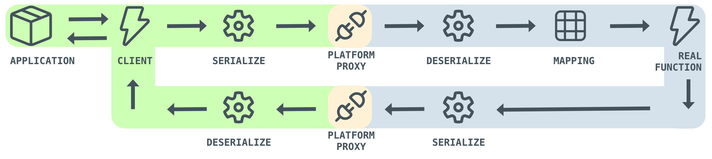

<p align="center">
    <a href="https://github.com/xplpc/xplpc" target="_blank" rel="noopener noreferrer">
        
    </a>
    <br>    
    XPLPC - Cross Platform Lite Procedure Call
    <br>
</p>

<p align="center">
    <a href="https://github.com/xplpc/xplpc/actions/workflows/cxx.yml"></a>
    <a href="https://github.com/xplpc/xplpc/actions/workflows/kotlin.yml"></a>
    <a href="https://github.com/xplpc/xplpc/actions/workflows/swift.yml"></a>
</p>

<p align="center">
    <a href="https://www.codacy.com/gh/xplpc/xplpc/dashboard?utm_source=github.com&amp;utm_medium=referral&amp;utm_content=xplpc/xplpc&amp;utm_campaign=Badge_Grade"></a>
</p>

## Project

The `XPLPC` project connects `languages` and `platforms` transfering `serialized` data between them without a `server`, but using device `memory`.

It is `Lite Procedure Call` because the `Platform Proxy` class connect both `languages` and `platforms` and transfer data using device `memory` instead of `HTTP` protocol.

For example, you can call a procedure of `C++ code` from `mobile application` or call a `mobile application` procedure from `C++ code`.

As the `XPLPC` project does not use `generators` or it `own tools`, the generated library can be added to your project `without rewriting` your code or your application, as it is `plug-and-play`, making it possible to fully reuse of code.

## Workflow

<p align="center">
    <a href="https://github.com/xplpc/xplpc" target="_blank" rel="noopener noreferrer">
        
    </a>
</p>

## How to use

Using C++ code:

```c++
auto request = Request{
    "platform.battery.level",
    Param<std::string>{"suffix", "%"},
};

auto response = RemoteClient::call<std::string>(request);
std::cout << "Returned Value: " << (response ? response.value() : "ERROR") << std::endl;
```

Using Kotlin code:

```kotlin
val request = Request(
    "sample.login",
    Param("username", "paulo"),
    Param("password", "123456"),
    Param("remember", true)
)

val response = RemoteClient.call<String>(request) ?: "ERROR"
println("Returned Value: $response")
```

Using Swift code:

```swift
let request = Request(
    "sample.login",
    Param("username", "paulo"),
    Param("password", "123456"),
    Param("remember", true)
)

let response: String = RemoteClient.call(request) ?? "ERROR"
print("Returned Value: \(response)")
```

## Supported platforms

*  C++
*  Kotlin
*  Swift

## Documentation

*  [General](docs/general.md)
*  [C++](docs/cxx.md)
*  [Kotlin](docs/kotlin.md)
*  [Swift](docs/swift.md)
*  [Python](docs/python.md)

## Contribution

Special thanks to:

*  [Yevgeniy Zakharov](https://github.com/fnc12) and [Arthur O'Dwyer](https://github.com/quuxplusone) for the help with C++ code
*  [Brett Best](https://github.com/Brett-Best) for the help with Swift code

## License

[MIT](http://opensource.org/licenses/MIT)

Copyright (c) 2022, Paulo Coutinho
