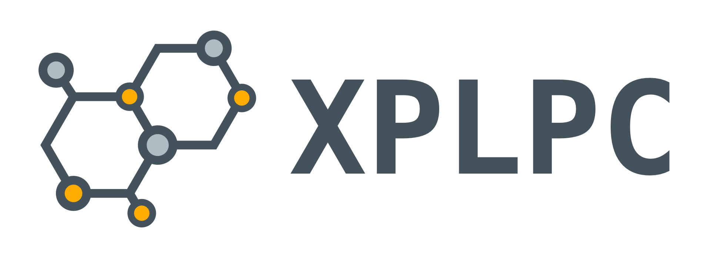

<p align="center">
    <a href="https://github.com/xplpc/xplpc" target="_blank" rel="noopener noreferrer">
        
    </a>
    <br>    
    XPLPC - Cross Platform Lite Procedure Call
    <br>
</p>

<p align="center">
    <a href="https://github.com/xplpc/xplpc/actions/workflows/cxx.yml"></a>
    <a href="https://github.com/xplpc/xplpc/actions/workflows/kotlin.yml"></a>
    <a href="https://github.com/xplpc/xplpc/actions/workflows/swift.yml"></a>
    <a href="https://github.com/xplpc/xplpc/actions/workflows/wasm.yml"></a>
</p>

<p align="center">
    <a href="https://www.codacy.com/gh/xplpc/xplpc/dashboard?utm_source=github.com&amp;utm_medium=referral&amp;utm_content=xplpc/xplpc&amp;utm_campaign=Badge_Grade"></a>
</p>

## Project

The `XPLPC` project enables the transfer of serialized data between `languages` and `platforms` without the need for a server, by utilizing local device memory.

This is achieved through the use of the `Lite Procedure Call` (LPC) `Platform Proxy` class, which connects the different languages and platforms and facilitates data transfer `without` the use of the HTTP protocol or other client/server mechanism.

This allows for `procedures` to be called between C++ code and any applications (desktop, mobile and web), and also allows for applications to call procedures in C++ code.

Additionally, since the XPLPC project does `not require` the use of `generators` or `specialized tools`, the resulting library can easily be integrated into existing projects, allowing for full code reusability and a plug-and-play experience.

## Workflow

<p align="center">
    <a href="https://github.com/xplpc/xplpc" target="_blank" rel="noopener noreferrer">
        
    </a>
</p>

## How to use

Using C++ code:

```cpp
auto request = Request{
    "platform.battery.level",
    Param<std::string>{"suffix", "%"},
};

RemoteClient::call<std::string>(request, [](const auto &response) {
    std::cout << "Returned Value: " << (response ? response.value() : "Empty") << std::endl;
});
```

Using Kotlin code:

```kotlin
val request = Request(
    "sample.login",
    Param("username", "paulo"),
    Param("password", "123456"),
    Param("remember", true)
)

RemoteClient.call<String>(request) { response ->
    println("Returned Value: $response")    
}
```

Using Swift code:

```swift
let request = Request(
    "sample.login",
    Param("username", "paulo"),
    Param("password", "123456"),
    Param("remember", true)
)

RemoteClient.call(request) { (response: String?) in
    print("Returned Value: \(response)")
}
```

Using WASM with Typescript:

```typescript
const request = new XRequest(
    "sample.login",
    new XParam("username", "paulo"),
    new XParam("password", "123456"),
    new XParam("remember", true),
);

XRemoteClient.call<string>(request).then((response : string | undefined) => {
    console.log("Returned Value: " + response);
});
```

You can use `LocalClient` instead of `RemoteClient` to call `local` mapped methods.

And you can use `ProxyClient` to send manually the `serialized message` to simulate a call by a client.

## Supported platforms

*   C++
*   Kotlin
*   Swift
*   WASM

## Documentation

*   [General](docs/general.md)
*   [C++](docs/cxx.md)
*   [Kotlin](docs/kotlin.md)
*   [Python](docs/python.md)
*   [Swift](docs/swift.md)
*   [WASM](docs/wasm.md)
*   [Contribution](docs/contribution.md)

## License

[MIT](http://opensource.org/licenses/MIT)

Copyright (c) 2022-2023, Paulo Coutinho
